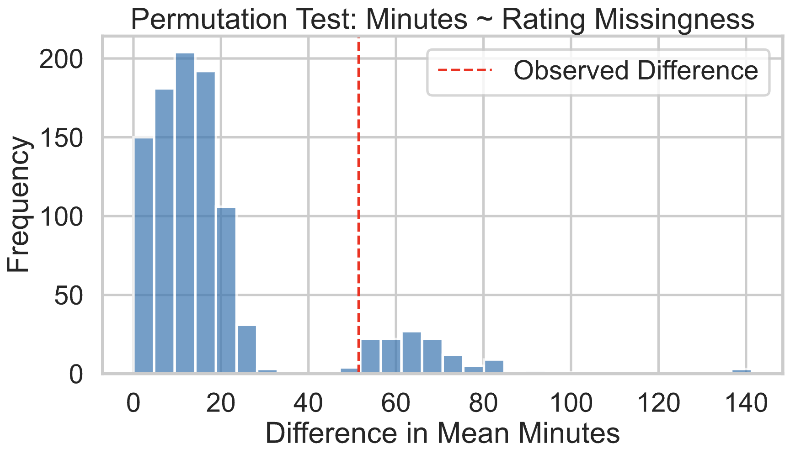

# Predicting Recipe Health

By: Mieko Chun and Margot Nissen

## Overview
This DSC 80 project focuses on predicting how healthy a recipe is using features such as nutrition ratings and health tags associated with each recipe.

## Introduction
As health and nutrition become a greater concern, it's important for people to understand the nutritional content of a recipe. This project helps users make better dietary decisions by analyzing recipes through their nutritional ratings and tags.

We used two datasets: **Recipes** and **Interactions**.

### Recipe Dataset (83,782 rows, 12 columns)

| Column        | Description                                                                  |
|---------------|------------------------------------------------------------------------------|
| `name`        | Name of the recipe                                                           |
| `id`          | ID of the recipe                                                             |
| `minutes`     | How long it took to make the recipe                                          |
| `submitted`   | When the recipe was added to the website                                     |
| `tags`        | Descriptors about the recipe                                                 |
| `nutrition`   | Nutritional facts: calories, fat, sugar, sodium, protein, sat. fat, carbs    |
| `ingredients` | Ingredients needed for the recipe                                            |

### Interactions Dataset (731,927 rows, 5 columns)

| Column       | Description                                       |
|--------------|---------------------------------------------------|
| `recipe_id`  | ID of the recipe                                  |
| `date`       | When the user submitted their rating              |
| `rating`     | Rating given by the user                          |
| `review`     | Comment made by the user about the recipe         |

There are more ratings than recipes because some recipes have multiple ratings, and some have none.

---

## Data Cleaning and Exploratory Data Analysis

### Data Cleaning
1. **Merged datasets**:
    
    ```py
    merged_data = recipes.merge(ratings, left_on='id', right_on='recipe_id', how='left')
    merged_data['rating'] = merged_data['rating'].replace(0.0, np.nan)
    ```
    - This kept all recipes, and treated `0.0` ratings as missing.

2. **Handled missing ratings**:
    - Replaced 0.0 ratings with `np.NaN`
    - If all missing ratings were 0.0, the total average rating would be skewed lower than it should be

3. **Created `avg_rating`**:
    - Shows the average rating per recipe.

4. **Converted nutrition strings to floats**:
    - Enabled health score computation.

5. **Created `health_rating` column**:
    - Based on tags categorized into "healthy", "medium healthy", and "unhealthy":

    ```py
    healthy_keywords = {'healthy-2', 'healthy', 'salads', 'chard', 'vegan', 'very-low-carbs', 'vegetarian', 'high-fiber', 'spinach', 'low-carb', 'low-sodium', 'low-calorie', 'vegetables', 'low-fat', 'low-saturated-fat'}
    midhealthy_keywords = {'high-protein', 'pork-sausage', 'smoothies', 'desserts-fruit', 'low-in-something', 'pot-pie', 'dairy-free', 'gluten-free', 'casseroles', 'tex-mex'}
    unhealthy_keywords = {'drop-cookies', 'desserts', 'super-bowl', 'brownies', 'cakes', 'cake-fillings-and-frostings', 'fudge', 'rolled-cookies', 'cookies-and-brownies', 'cupcakes', 'desserts-easy', 'pies-and-tarts', 'sugar-cookies', 'fillings-and-frostings-chocolate', 'chocolate-chip-cookies', 'ice-cream'}
    ```
6. **Computed `health_score` column**:
    - Weighted nutritional values to quantify health:

    | Nutritional Fact         | Impact |
    | ------------------------ | -------|
    | calories (#)             | 0.15   |
    | total fat (PDV)          | 0.15   |
    | sugar (PDV)              | 0.3    |
    | sodium (PDV)             | 0.1    |
    | protein (PDV)            | -0.2   |
    | saturated fat (PDV)      | 0.25   |
    | carbohydrates (PDV)      | 0.1    |

    - Protein gets a negative weight due to its generally positive health impact.

7. **Cretead `health_rating_num` column**:
    - It makes a numerical column representing the health ratings
    ```py
    'unknown': 0,
    'healthy': 1,
    'medium healthy': 2,
    'unhealthy': 3
    ```

7. **Grouped by recipe name**:
    - Prevented duplicate recipe names from skewing the results.
  
---

Our final DataFrame has 83,628 rows and 20 columns. Here's a sample row:

| name | id | tags | nutrition| n_ingredients | rating | avg_rating | difficulty | health_rating | health_score |
|------|----|------|----------|---------------|--------|------------|------------|---------------|--------------|
| 0 carb 0 cal gummy worms | 45 | [...] | [384.7, 0.0, 0.0, ...]| 3 | 5 | 4.75 | intermediate | unhealthy | 33.5 |

---

### Univariate Analysis
This histogram shows the distribution of Health Scores with the outliers removed. The lower the health score, the better. This plot helps the users understand the scale of the scores which will be useful when interpreting the rest of the analysis. The mean of the data is **97.712** and and the median health score is **64.999**. The distribution is skewed right histogram, so a higher proportion of recipes are on the healthier end of the scale.

<iframe
  src="assets/univariate_health_scores.html"
  width="800"
  height="600"
  frameborder="0"
></iframe>

### Bivariate Analysis
This box plot shows the distribution of health scores across four health rating categories: healthy, medium healthy, unhealthy, and unknown, with outliers removed. Overall, we see that recipes labeled as healthy tend to have lower health scores (indicating better health), while unhealthy recipes have higher and more variable scores, suggesting a clear trend in health score as health rating decreases (becomes healthier).

<iframe
  src="assets/box_plot_health_scores.html"
  width="800"
  height="600"
  frameborder="0"
></iframe>

## Assessment of Missingness
In our final dataframe that is grouped by recipe, there are three columns that have a significant number of missing values. These are, 'description', 'rating', and 'review'.

### NMAR Analysis
The 'review' column is NMAR because the missingness of the value is dependent on the fact that the user decided not to leave a review. That is, the reason the review column is blank is because the user decided that they didn't want to leave a review. Its missingness is not dependent on any other column, but rather, the missing value itself.

### MAR Analysis
We moved on to examine the missingness of 'rating' in the merged DataFrame by testing the dependency of its missingness. We are investigating whether the missiness in the 'rating' column depends on the column 'health_score', which is the feature we create to determine each recipe's health by creating a weighted score based on its nutritional values.

#### Health Score and Rating
**Null Hypothesis:** The missingness of ratings does not depend on the health score of the recipe.

**Alternate Hypothesis:** The missingness of ratings does depend on the health score of the recipe.

**Test Statistic:** The absolute difference of mean in the health score of the distribution of the group without missing ratings and the distribution of the group with missing ratings.

**Significance Level:** 0.05

<iframe
  src="assets/health_score_dist_by_missingness.html"
  width="800"
  height="600"
  frameborder="0"
></iframe>


#### Results
**Observed Difference: 19.6667**
The absolute difference between the average health scores of recipes with missing ratings and recipes with ratings present is about 19.67. This is a pretty big difference, indicating that the two groups differ substantially in their health scores.

**P-value: 0.0000**
The p-value (probability of seeing a difference at least this extreme if the null hypothesis were true) is effectively 0 (or very close to zero). This means it is extremely unlikely that such a large difference in health scores between missing and non-missing ratings would happen by random chance if missingness were truly independent of health score.

**Interpretation:**
Since the p-value is much smaller than your significance level (e.g., 0.05), you reject the null hypothesis and conclude:

The missingness of rating depends on the health_score of the recipe. In other words, whether a recipe’s rating is missing is related to how healthy that recipe is. This suggests Missing At Random (MAR) rather than Missing Completely At Random (MCAR).


### Minutes and Rating
**Null Hypothesis:** The missingness of ratings does not depend on the minutes the recipe takes.

**Alternate Hypothesis:** The missingness of ratings does depend on the minutes the recipe takes.

**Test Statistic:** The absolute difference of mean in the minutes of the distribution of the group without missing ratings and the distribution of the group with missing ratings.

**Significance Level:** 0.05

<iframe
  src="assets/minutes_dist_by_missingness.html"
  width="800"
  height="600"
  frameborder="0"
></iframe>



#### Results
**Observed Difference: 51.4524**
On average, the time difference between recipes with and without missing ratings is ~51 minutes.

**P-value: 0.1040**
This is the probability of seeing a difference this large (or larger) just by random chance if the null hypothesis were true.

**Interpretation:**
Since p-value (0.1040) > significance level (0.05), we fail to reject the null hypothesis. You do not have statistically significant evidence that the missingness in rating depends on minutes. Although there's a noticeable average time difference between recipes with and without ratings, there's not enough statistical evidence to say that recipe duration (minutes) explains why ratings are missing.


## Hypothesis Testing

### Null Hypothesis
There is no difference between the ratings of recipes that have health scores less than or equal to 61.81 and recipes that have health scores greater than 61.81.

### Alternative Hypothesis:
Recipes that have health scores greater than 61.81 get higher ratings than recipes that have health scores less than or equal to 61.81.


### Test Statistic
Difference in Group Means
```py
mean_health_score_by_rating = by_recipe.groupby('health_rating')['health_score'].median()
print(mean_health_score_by_rating)

health_rating
healthy           55.49
medium healthy    61.81
unhealthy         83.49
unknown           67.98
Name: health_score, dtype: float64
```
<iframe
  src="assets/health_score_dist_by_missingness.html"
  width="800"
  height="600"
  frameborder="0"
></iframe>

### Results
**Observed Difference: -0.003661316119038638**
This is: mean_rating_healthy - mean_rating_unhealthy
So: Healthy recipes (lower health score) have slightly lower ratings than unhealthy recipes.
But the difference is very small — only about 0.0037 rating points, which is nearly negligible.


**P-value: 0.213**
We asked: Do unhealthy recipes get higher ratings than healthy ones?
A p-value of 0.213 means there's a 21.3% chance of seeing a difference as extreme (or more extreme) than our observed one just by random chance, assuming the null hypothesis is true. Since this is greater than 0.05, we fail to reject the null hypothesis.

**Interpretation**
There is no statistically significant evidence that unhealthy recipes are rated higher than healthy ones. The data leans in that direction (since the difference is negative), but the evidence isn’t strong enough to say it’s a real effect.

## Framing a Prediction Problem
In this project, we aim to build a multiclass classification model to predict the healthiness level of a recipe based on its metadata and nutritional information. Specifically, the model classifies each recipe into one of three categories: "healthy", "medium healthy", or "unhealthy".


**Target Variable: health_rating**
This is a categorical variable with three classes: healthy, medium healthy, and unhealthy.


It was derived based on the presence of health-related tags associated with each recipe. Tags were scored using a custom weighting system, and thresholds were set to assign one of the three labels.


**Why this variable:**
Understanding and predicting the healthiness of a recipe is valuable for users aiming to make informed dietary choices. It also allows us to explore how recipe metadata and nutrition correlate with perceived healthiness.

**Evaluation Metric**
We evaluate our model using the F1-score (macro average).


**Why not accuracy:**
Since the class distribution is imbalanced (e.g., more recipes labeled "healthy"), accuracy could be misleading — a model that always predicts the majority class would appear to perform well.


**Why F1-score:**
The F1-score balances precision and recall, giving a more informative measure of performance on each class, especially for underrepresented ones like unhealthy or medium healthy. The macro-averaged F1 ensures each class is treated equally, regardless of how many examples it contains.


## Baseline Model
We trained a baseline classification model to predict a recipe's health rating using only its nutritional information. The model uses a Random Forest Classifier, chosen because of its ability to handle nonlinear relationships and unscaled features.

We have 7 quantitative features:
- calories
- total_fat_PDV
- sugar_PDV
- sodium_PDV
- protein_PDV
- saturated_fat_PDV
- carbohydrates_PDV

Since all the features are numerical, we did not have to do any encoding.

**Model and Pipeline**
The model was wrapped in a Pipeline for modularity, combining preprocessing and model training. The RandomForestClassifier was trained with class weighting to address imbalanced classes.

**Performance**
On the held-out test set, the model achieved:
- Accuracy: 62%
- F1-scores:
    - Healthy: 0.76
    - Medium Healthy: 0.07
    - Unhealthy: 0.47
    - Macro Average F1: 0.43

**Evaluation**
While the model performs reasonably well for predicting “healthy” recipes (precision = 0.65, recall = 0.90), it performs poorly on “medium healthy” (F1 = 0.07), suggesting that it has difficulty distinguishing this middle class. The overall macro F1-score of 0.43 indicates that the model struggles with class balance and nuance, especially for the less frequent or less clearly defined classes.

We consider this a reasonable but not strong baseline. It shows that nutritional information contains some signal for predicting health rating, but there's substantial room for improvement — potentially by including non-nutritional features (e.g., ingredients, preparation methods) or applying more sophisticated models or oversampling methods to address imbalance.

## Final Model
Here is a chart we used to decide which features to use for our final model:

| Feature | Type | Info at Submission Time? | Correlated with Nutrition? |
| ------- | ---- | ------------------------ | -------------------------- |
| Name | Text | Yes | Probably Not | 
| submitted | Date | Yes | Maybe (trends over time) |
| minutes | Numeric | Yes | Maybe (short = simple) |
| n_steps | Numeric | Yes | Maybe (complexity) |
| tags | List of strings | Yes | Yes (i.e. 'low-fat') |
| health_rating | Categorical | Yes | Yes (based on tags) |
| health_rating_num | Numeric version | Yes | Yes |
| rating, review, user_id, recipe_id, date | Metadata | No, after submission | No (invalid for prediction) |

1. **Feature Engineering:** Creates two new features — **calories per minute** (how many calories per minute it takes to prepare the recipe) and **sugar-to-protein ratio** (a measure comparing sugar to protein content) — to provide more meaningful signals for the model.

2. **Data Preparation:** We selected the relevant columns including numeric nutrition values, recipe details, and the health rating label; then removed any rows with missing data to ensure clean input.

3. **Train-Test Split:** Split the dataset into training and testing subsets, making sure the distribution of health rating classes was similar in both sets by stratifying the split.

4. **Preprocessing Pipeline:** Applied standard scaling to numeric features so they would on comparable scales, and converted the recipe descriptions into numerical features using TF-IDF to capture important text patterns.

5. **Model Setup:** Used a Random Forest classifier that accounted for class imbalance by weighting classes inversely to their frequency, improving prediction fairness across classes.

6. **Hyperparameter Tuning:** Ran a grid search with cross-validation over various Random Forest parameters (like number of trees, tree depth, etc.) to find the best combination that maximized macro F1 score.

7. **Training:** Fit the model with the best parameters found on the training data.

8. **Evaluation:** Tested the trained model on the unseen test data, then reported conclusions.

**Overall F1 Macro: 0.4884**

**Overall F1 Weighted: 0.5605**


### Analysis
1. **Improved Balance on Minority Classes:**
    The final model significantly improves recall and F1-score for the “medium healthy” class (Recall 0.35 vs. 0.04; F1 0.29 vs. 0.07), which was very poorly detected by the baseline. This shows the final model is much better at recognizing this previously underrepresented category.
2. **Better Recall on "Unhealthy":**
    Recall for the "unhealthy" class also improved (0.51 vs. 0.40), meaning the final model catches more true "unhealthy" cases.
3. **Tradeoff with Healthy Class:**
    Although the baseline model had a much higher recall for the “healthy” class (0.90 vs. 0.62), the final model has better precision here (0.73 vs. 0.65), suggesting fewer false positives when predicting "healthy." This reflects a shift toward more balanced predictions rather than over-predicting the majority class.
4. **Slightly Lower Accuracy but More Meaningful:**
    The final model’s accuracy decreased (0.55 vs. 0.62), but accuracy can be misleading when classes are imbalanced. The final model’s improvements in minority classes and balanced macro F1-score indicate better overall classification quality.
5. **Overall Macro F1 Improved:**
    Macro F1-score increased from 0.43 to 0.49, showing better average performance across all classes — especially the minority ones.
6. **Weighted F1 Stable:**
    Weighted F1 remains about the same (~0.56), meaning the final model maintains similar overall weighted performance while improving fairness across classes.

### Conclusion
The final model is better because it addresses the key weakness of the baseline: poor detection of “medium healthy” and “unhealthy” classes. It achieves a more balanced classification by improving recall and F1-scores on these minority classes at the cost of some accuracy and recall for the majority “healthy” class. This balance is often preferable in practical scenarios where detecting all categories fairly is important.

## Fairness Analysis

