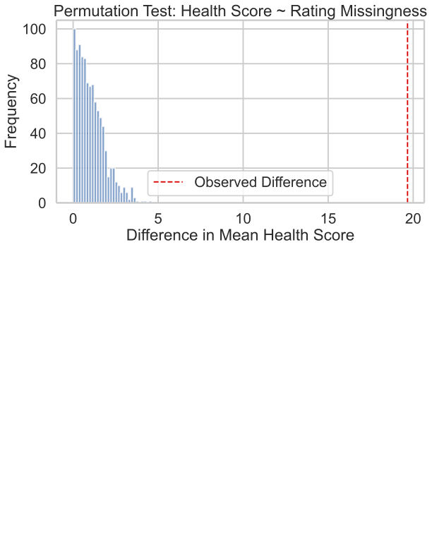

# Predicting Recipe Health

By: Mieko Chun and Margot Nissen

## Overview
This DSC 80 project focuses on predicting how healthy a recipe is using features such as nutrition ratings and health tags associated with each recipe. We are trying to categorize recipes as 'healthy', 'medium-healthy' or 'unhealthy' based on the variables in the recipes and interactions datasets. We will analyze a variety of methods to define 'healthiness' including looking at recipe tags and nutrition information. Our end goal is to create a useful classifier to assign recipes to each of the health ratings.

## Introduction
As health and nutrition become a greater concern, it's important for people to understand the nutritional content of a recipe. This project helps users make better dietary decisions by analyzing recipes through their nutritional ratings and tags.

We used two datasets: **Recipes** and **Interactions**.

### Recipe Dataset (83,782 rows, 12 columns)

| Column        | Description                                                                  |
|---------------|------------------------------------------------------------------------------|
| `name`        | Name of the recipe                                                           |
| `id`          | ID of the recipe                                                             |
| `minutes`     | How long it took to make the recipe                                          |
| `submitted`   | When the recipe was added to the website                                     |
| `tags`        | Descriptors about the recipe                                                 |
| `nutrition`   | Nutritional facts: calories, fat, sugar, sodium, protein, sat. fat, carbs    |
| `ingredients` | Ingredients needed for the recipe                                            |

### Interactions Dataset (731,927 rows, 5 columns)

| Column       | Description                                       |
|--------------|---------------------------------------------------|
| `recipe_id`  | ID of the recipe                                  |
| `date`       | When the user submitted their rating              |
| `rating`     | Rating given by the user                          |
| `review`     | Comment made by the user about the recipe         |

There are more ratings than recipes because some recipes have multiple ratings, and some have none.

---

## Data Cleaning and Exploratory Data Analysis

### Data Cleaning
1. **Merged datasets**:
    
    ```py
    merged_data = recipes.merge(ratings, left_on='id', right_on='recipe_id', how='left')
    merged_data['rating'] = merged_data['rating'].replace(0.0, np.nan)
    ```
    - This kept all recipes, and treated `0.0` ratings as missing.

2. **Handled missing ratings**:
    - Replaced 0.0 ratings with `np.NaN`
    - If all missing ratings were 0.0, the total average rating would be skewed lower than it should be

3. **Created `avg_rating`**:
    - Shows the average rating per recipe.

4. **Converted nutrition strings to floats**:
    - Enabled health score computation.

5. **Created `health_rating` column**:
    - Based on tags categorized into "healthy", "medium healthy", and "unhealthy":
    - Assigning weights to a curated list of keywords: +2 for healthy-related tags, +1 for moderately healthy, and -2 for unhealthy tags.
    - Parsing each recipe’s tags column from a string to a list (using ast.literal_eval) and computing a total score based on the tag weights.
    - Mapping the score to a label: if the score is ≥2 it's "healthy", 0–1 is "medium healthy", and <0 is "unhealthy". This result is stored in a new column called health_rating.

    ```py
    healthy_keywords = {
    'apples', 'artichoke', 'asparagus', 'avocado', 'bananas', 'berries', 'black-beans',
    'blueberries', 'bok-choys', 'broccoli', 'brown-rice', 'cabbage', 'carrots', 'cauliflower',
    'chard', 'cherries', 'chick-peas-garbanzos', 'citrus', 'collard-greens', 'coconut',
    'corn', 'cranberry-sauce', 'cucumber', 'dates', 'dairy-free', 'diabetic', 'eggplant',
    'eggs', 'fruit', 'gluten-free', 'grapes', 'greens', 'high-fiber', 'high-protein', 'kiwifruit',
    'lentils', 'lettuces', 'low-calorie', 'low-carb', 'low-cholesterol', 'low-fat',
    'low-saturated-fat', 'low-sodium', 'mango', 'melons', 'mushrooms', 'nuts', 'oatmeal',
    'orange', 'papaya', 'pears', 'peppers', 'pineapple', 'plums', 'pumpkin', 'raspberries',
    'salads', 'salmon', 'spinach', 'strawberries', 'sweet-potatoes', 'tomatoes', 'tropical-fruit',
    'turkey', 'vegan', 'vegetables', 'vegetarian', 'very-low-carbs', 'zucchini'
    }
    midhealthy_keywords = {
    'african', 'american', 'amish-mennonite', 'argentine', 'asian', 'australian', 'austrian', 'baja',
    'baking', 'bean-soup', 'beans', 'breakfast', 'breakfast-casseroles', 'british-columbian',
    'cajun', 'cambodian', 'camping', 'canadian', 'canning', 'caribbean', 'casseroles', 'chicken',
    'chicken-breasts', 'chicken-stew', 'chinese', 'comfort-food', 'cooking-mixes', 'cuban',
    'curries', 'danish', 'dinner-party', 'dips', 'dips-lunch-snacks', 'ecuadorean', 'eggs-dairy',
    'english', 'ethiopian', 'european', 'filipino', 'french', 'freshwater-fish', 'frozen-desserts',
    'fruit', 'german', 'gluten-free', 'greek', 'grilling', 'hawaiian', 'heirloom-historical',
    'high-in-something', 'holiday-event', 'hungarian', 'indian', 'indonesian', 'irish', 'italian',
    'japanese', 'jewish-ashkenazi', 'jewish-sephardi', 'kid-friendly', 'korean', 'kosher', 'laotian',
    'lebanese', 'libyan', 'low-in-something', 'macaroni-and-cheese', 'malaysian', 'mardi-gras-carnival',
    'mexican', 'middle-eastern', 'midwestern', 'mongolian', 'moroccan', 'mothers-day', 'muffins',
    'native-american', 'nepalese', 'new-years', 'new-zealand', 'nigerian', 'non-alcoholic',
    'north-american', 'northeastern-united-states', 'norwegian', 'oaxacan', 'pakistani',
    'palestinian', 'pasta', 'peruvian', 'philippine', 'picnic', 'polish', 'polynesian',
    'puerto-rican', 'quiche', 'quick-breads', 'ramadan', 'russian', 'salad-dressings', 'salads',
    'saudi-arabian', 'scandinavian', 'seafood', 'seasonal', 'simply-potatoes', 'snacks',
    'south-african', 'south-american', 'southwestern-united-states', 'spanish', 'spinach',
    'spring', 'swedish', 'thai', 'thanksgiving', 'tilapia', 'turkish', 'valentines-day', 'veggie-burgers',
    'vietnamese', 'weeknight', 'welsh', 'white-rice', 'wild-game', 'winter', 'yams-sweet-potatoes'
    }
    unhealthy_keywords = {
    'bacon', 'bar-cookies', 'barbecue', 'bear', 'beef', 'beef-barley-soup', 'beef-crock-pot',
    'beef-kidney', 'beef-liver', 'beef-organ-meats', 'beef-ribs', 'beef-sausage', 'birthday',
    'biscotti', 'biscuits', 'bread-pudding', 'bread', 'brownies', 'burgers', 'cake-fillings-and-frostings',
    'cakes', 'candy', 'cheese', 'cheesecake', 'chocolate', 'chocolate-chip-cookies', 'cocktails',
    'coffee-cakes', 'cookies-and-brownies', 'cupcakes', 'deep-fry', 'desserts', 'desserts-easy',
    'desserts-fruit', 'drop-cookies', 'fudge', 'gelatin', 'gifts', 'ham', 'ham-and-bean-soup',
    'hand-formed-cookies', 'halloween-cakes', 'halloween-cupcakes', 'ice-cream', 'jams-and-preserves',
    'jellies', 'macaroni-and-cheese', 'marinades-and-rubs', 'mashed-potatoes', 'meat', 'meatballs',
    'meatloaf', 'microwave', 'muffins', 'nachos', 'oamc-freezer-make-ahead', 'oven', 'pancakes-and-waffles',
    'pastry', 'peanut-butter', 'pies', 'pies-and-tarts', 'pizza', 'popcorn', 'pork', 'pork-chops',
    'pork-crock-pot', 'pork-loin', 'pork-ribs', 'pork-sausage', 'pot-roast', 'potatoes', 'pressure-cooker',
    'puddings-and-mousses', 'punch', 'quebec', 'quick-breads', 'reynolds-wrap', 'roast-beef',
    'roast-beef-comfort-food', 'roast-beef-main-dish', 'rolled-cookies', 'rolls-biscuits',
    'savory-pies', 'savory-sauces', 'scones', 'short-grain-rice', 'sugar-cookies', 'super-bowl',
    'superbowl', 'sweet', 'sweet-sauces', 'tarts', 'toddler-friendly', 'tuna', 'turkey-burgers',
    'whitefish', 'yeast'
    }
    ```
    The resulting column `health_rating` is distrubuted:
   ```py
    health_rating
    healthy           48567
    unhealthy         19208
    medium healthy    15853
    Name: count, dtype: int64
   ```
6. **Computed `health_score` column**:
    - Weighted nutritional values to quantify health:

    | Nutritional Fact         | Impact |
    | ------------------------ | -------|
    | calories (#)             | 0.15   |
    | total fat (PDV)          | 0.15   |
    | sugar (PDV)              | 0.3    |
    | sodium (PDV)             | 0.1    |
    | protein (PDV)            | -0.2   |
    | saturated fat (PDV)      | 0.25   |
    | carbohydrates (PDV)      | 0.1    |

    - Protein gets a negative weight due to its generally positive health impact.

7. **Created `health_rating_num` column**:
    - It makes a numerical column representing the health ratings
    ```py
    'healthy': 0,
    'medium healthy': 1,
    'unhealthy': 2
    ```

8. **Grouped by recipe name**:
    - Prevented duplicate recipe names from skewing the results.
  
---

Our final DataFrame has 83,628 rows and 20 columns. Here's a sample row:

| name | minutes | tags | nutrition| n_steps | rating | avg_rating | health_rating | health_score |
|------|----|------|----------|---------------|--------|------------|------------|---------------|--------------|
| 0 carb 0 cal gummy worms | 45 | [...] | [384.7, 0.0, 0.0, ...]| 3 | 5 | 4.75 | unhealthy | 33.5 |

---

### Univariate Analysis
This histogram shows the distribution of 'health_score' with the outliers removed. **Low health scores mean healthier recipes**. This plot helps the users understand the scale of the scores which will be useful when interpreting the rest of the analysis. The mean of the data is **97.712** and and the median health score is **64.999**. The distribution is skewed right histogram, so a higher proportion of recipes are on the healthier end of the scale.

<iframe
  src="assets/univariate_health_scores.html"
  width="800"
  height="600"
  frameborder="0"
></iframe>
### Bivariate Analysis
This box plot shows the distribution of health scores across three health rating categories: healthy, medium healthy, and unhealthy with outliers removed. Overall, we see that recipes labeled as healthy tend to have lower health scores (indicating better health), while unhealthy recipes have higher and more variable scores, suggesting a clear trend in health score as health rating decreases (becomes healthier).

<iframe
  src="assets/box_plot_health_scores.html"
  width="800"
  height="600"
  frameborder="0"
></iframe>
## Assessment of Missingness
In our final dataframe that is grouped by recipe, there are three columns that have a significant number of missing values. These are, 'description', 'rating', and 'review'.

### NMAR Analysis
The 'review' column is NMAR because the missingness of the value is dependent on the fact that the user decided not to leave a review. Some users only leave reviews when they really like a recipe. If they really disliked it, they might not bother reviewing at all. So, bad reviews may be missing. People with strong opinions (very good or very bad) are more likely to write reviews. People who feel neutral might skip it. So reviews are biased toward emotional extremes, and moderate reviews may be missing. Its missingness is not dependent on any other column, but rather, the missing value itself.

### MAR Analysis
Next we will examine the missingness of 'rating' in the merged DataFrame by testing the dependency of its missingness. We are investigating whether the missiness in the 'rating' column depends on the column 'health_score', which is the feature we created to determine each recipe's health by creating a weighted score based on its nutritional values. Lower scores correspond to healthier recipes.

#### Health Score and Rating
**Null Hypothesis:** The missingness of ratings does not depend on the health score of the recipe.

**Alternate Hypothesis:** The missingness of ratings does depend on the health score of the recipe.

**Test Statistic:** The absolute difference of means between the health scores of the group with missing ratings and the group without missing ratings.

**Significance Level:** 0.05

<iframe
  src="assets/health_score_dist_by_missingness.html"
  width="800"
  height="600"
  frameborder="0"
></iframe>

#### Results
**Observed Difference: 19.6667**

The absolute difference between the average health scores of recipes with missing ratings and recipes with ratings present is about 19.67. This is a pretty big difference, indicating that the two groups differ substantially in their health scores.

**P-value: 0.0000**

The p-value is effectively 0 (or very close to zero). This means it is extremely unlikely that such a large difference in health scores between missing and non-missing ratings would happen by random chance if missingness were truly independent of health score.

**Interpretation:**

Since the p-value is much smaller than the significance level (0.05), we reject the null hypothesis and conclude:

The missingness of 'rating' depends on the 'health_score' of the recipe. Whether a recipe’s rating is missing is related to how healthy that recipe is. This suggests 'rating' is Missing At Random (MAR) rather than Missing Completely At Random (MCAR).

### Minutes and Rating
Next we will analyze if the missingness of 'rating' depends on the 'minutes' a recipe takes to make. 

**Null Hypothesis:** The missingness of ratings does not depend on the minutes the recipe takes.

**Alternate Hypothesis:** The missingness of ratings does depend on the minutes the recipe takes.

**Test Statistic:** The absolute difference of means between the minutes of the group with missing ratings and the group without missing ratings.

**Significance Level:** 0.05

<iframe
  src="assets/minutes_dist_by_missingness.html"
  width="800"
  height="600"
  frameborder="0"
></iframe>

#### Results
**Observed Difference: 51.4524**

On average, the difference in minutes between recipes with and without missing ratings is ~51 minutes.

**P-value: 0.1040**

This is the probability of seeing a difference this large (or larger) just by random chance if the null hypothesis were true.

**Interpretation:**

Since p-value (0.1040) > significance level (0.05), we fail to reject the null hypothesis. We do not have statistically significant evidence that the missingness in rating depends on minutes. Although there's a noticeable average time difference between recipes with and without ratings, there's not enough statistical evidence to say that recipe duration (minutes) explains why ratings are missing.

## Hypothesis Testing 
We are interested in analyzing if recipes that are unhealthy get higher ratings compared to healthy recipes. We hypothesize that people may review 'unhealthy' recipes higher because they have higher sugar and fat content and may taste better. We are using data from our 'health_score' column which assigns a score to each recipe denoting its healthiness. Higher scores correspond to unhealthy recipes. We selected the cutoff between unhealthy and healthy recipes to be 68.81 because it is the median of the 'medium healthy' category and is at the center of the "health_score" data. 

Median 'health_score' of each 'health_rating' category:
```py
median_health_score_by_rating = by_recipe.groupby('health_rating')['health_score'].median()
print(median_health_score_by_rating)

health_rating
healthy           60.21
medium healthy    68.81
unhealthy         76.28
Name: health_score, dtype: float64
```

### Null Hypothesis
There is no difference between the ratings of recipes have health scores less than or equal to 68.81 and recipes that have health scores greater than 68.81. 

### Alternative Hypothesis:
Recipes that have health scores greater than 68.81 get higher ratings than recipes that have health scores less than or equal to 68.81.

### Test Statistic
Difference in Group Means

<iframe
  src="assets/health_score_perm.html"
  width="800"
  height="600"
  frameborder="0"
></iframe>
### Results
**Observed Difference: -0.0061669**

This is: mean_rating_healthy - mean_rating_unhealthy

So: Healthy recipes (lower health score) have slightly lower ratings than unhealthy recipes.
But the difference is small.

**P-value: 0.099**

A p-value of 0.099 means there's a 9.9% chance of seeing a difference as extreme (or more extreme) than our observed one just by random chance, assuming the null hypothesis is true. Since this is greater than 0.05, we fail to reject the null hypothesis.

**Interpretation:**

There is no statistically significant evidence that unhealthy recipes are rated higher than healthy ones. That said, the data leans in that direction (since the difference is negative), but the evidence isn’t strong enough to say it’s a real effect.

## Framing a Prediction Problem
In this project, we aim to build a multiclass classification model to predict the healthiness rating of a recipe based on its data and nutritional information. Specifically, we want our model to classify each recipe into one of three categories: "healthy", "medium healthy", or "unhealthy" as found in the 'health_rating' column which is based on each recipe's tags.


**Target Variable: health_rating**
This is a categorical variable with three classes: healthy, medium healthy, and unhealthy. It is  based on the presence of health-related tags associated with each recipe. Tags were scored using a custom weighting system, and thresholds were set to assign each recipe one of the three labels.

**Why this variable:**
Understanding and predicting the healthiness of a recipe is valuable for users aiming to make informed dietary choices. It also allows us to explore how recipe data and nutrition correlate with perceived healthiness.

**Evaluation Metric**
We will evaluate our model using the F1-score (macro average). This measure averages the F1-scores for each class equally, which is important because we do not have equal numbers of 'unhealthy', 'medium healthy', and 'healthy' recipes.

**Why not accuracy:**
Since the class distribution is imbalanced (e.g., more recipes labeled "healthy"), accuracy could be misleading. This is because a model that always predicts the majority class would appear to perform well.

**Variables at the time of prediction**
At the time of prediction, we would have access to variables such as 'name', 'id', 'minutes', 'n_steps', 'description', 'tags', and 'nutrition' since these are known when each recipe is created. We would not neccesarily have access to feedback data such as 'rating', 'review', 'user_id', 'recipe_id', and 'date' which is constanly being added by new users who make the recipes.


## Baseline Model
We trained a baseline classification model to predict a recipe's health rating using only its nutritional information. The model uses a Random Forest Classifier, chosen because of its ability to handle nonlinear relationships and unscaled features.

We have 7 quantitative nutritional features:
- calories
- total_fat_PDV
- sugar_PDV
- sodium_PDV
- protein_PDV
- saturated_fat_PDV
- carbohydrates_PDV

Since all the features are numerical, we did not have to do any encoding.

**Model and Pipeline:**
The model was wrapped in a Pipeline for modularity, combining preprocessing and model training. The RandomForestClassifier was trained with class weighting to address imbalanced classes.

**Performance**
On the test set, the model achieved:
- Accuracy: 62%
- F1-scores:
    - Healthy: 0.76
    - Medium Healthy: 0.07
    - Unhealthy: 0.47
    - Macro Average F1: 0.43

```py
                  precision    recall  f1-score   support

       healthy       0.65      0.90      0.76      9713
medium healthy       0.24      0.04      0.07      3171
     unhealthy       0.57      0.40      0.47      3842

      accuracy                           0.62     16726
     macro avg       0.49      0.45      0.43     16726
  weighted avg       0.55      0.62      0.56     16726
```

- **Macro F1-score: 0.4327032746579715**
- **Weighted F1-score: 0.5605849860790696**

**Evaluation**
While the model performs reasonably well for predicting “healthy” recipes (precision = 0.65, recall = 0.90), it performs poorly on “medium healthy” (F1 = 0.07), suggesting that it has difficulty distinguishing this middle class. The overall macro F1-score of 0.43 indicates that the model struggles with class balance and nuance, especially for the less frequent or less clearly defined classes. This makes sense as the "medium healthy" class has more noise and less consistent labeling.

We consider this a reasonable but not strong baseline. It shows that nutritional information contains some insight for predicting health rating, but there's substantial room for improvement — potentially by including non-nutritional features (e.g., description, minutes) or applying more complex models or methods to address imbalance.

## Final Model
In our final model, we made a classification model to determine their health rating (either healthy, medium healthy, or unhealthy), based on the nutrition values in the nutrition column.

Here is a chart we used to decide which features to use for our final model:

| Feature | Type | Info at Submission Time? | Correlated with Nutrition? |
| ------- | ---- | ------------------------ | -------------------------- |
| Name | Text | Yes | Probably Not | 
| submitted | Date | Yes | Maybe (trends over time) |
| minutes | Numeric | Yes | Maybe (short = simple) |
| n_steps | Numeric | Yes | Maybe (complexity) |
| tags | List of strings | Yes | Yes (i.e. 'low-fat') |
| health_rating | Categorical | Yes | Yes (based on tags) |
| health_rating_num | Numeric version | Yes | Yes |
| rating, review, user_id, recipe_id, date | Metadata | No, after submission | No (invalid for prediction) |

**Steps to improve upon Baseline Model and create Final Model**

1. **Feature Engineering:** We created two new features — **calories per minute** (how many calories per minute it takes to prepare the recipe) and **sugar-to-protein ratio** (a measure comparing sugar to protein content) — to provide more meaningful signals for the model.

2. **Data Preparation:** We selected the relevant columns including numeric nutrition values, recipe details, and the health rating label; then removed any rows with missing data to ensure clean input.

3. **Train-Test Split:** Next, we split the dataset into training and testing subsets, making sure the distribution of health rating classes was similar in both sets by stratifying the split.

4. **Preprocessing Pipeline:** We then applied standard scaling to numeric features so they would on comparable scales, and converted the recipe descriptions into numerical features using TF-IDF to capture important text patterns.
   - Numerical:
       - Selected in numeric_features list
       - Processed by StandardScaler
       - Passed into the Random Forest as continuous input features for decision tree splits
   - Text:
       - Specified as text_features = 'description'
       - Processed by TfidfVectorizer with: max_features=200: Keeps top 200 most informative terms
       - Converts the description into a 200-dimensional vector
       - F-IDF vectors are passed into the Random Forest as additional features, helping the model capture language cues about healthiness
   - Target Variable:
       - Set as the target (y) 

6. **Model Setup:** Next, we used a Random Forest classifier that accounted for class imbalance by weighting classes inversely to their frequency, improving prediction fairness across classes.

7. **Hyperparameter Tuning:** Then we ran a grid search with cross-validation over various Random Forest parameters (like number of trees, tree depth, etc.) to find the best combination that maximized macro F1 score.

8. **Training:** Next, we fit the model with the best parameters found on the training data.

9. **Evaluation:** Tested the trained model on the unseen test data, then reported conclusions.

**Variables used in Final Model to Classify 'health_rating'**
- 'calories_per_minute': calories / (minutes + 1), this measures calorie density over time — high values might mean high-calorie, quick recipes
- 'sugar_protein_ratio': sugar_PDV / (protein_PDV + 1), high values suggest sweet but low-protein recipes — could indicate desserts or snacks
- 'minutes': Time (in minutes) to make the recipe, can reflect complexity or convenience
- 'n_steps': Number of cooking steps, can indicate complexity or convenience
- 'description': text that contains a short summary or blurb about the recipe, gives the model natural-language clues about the healthiness of a recipe
- 'nutrition' ('calories', 'total_fat_PDV', 'sugar_PDV', 'sodium_PDV', 'protein_PDV', 'saturated_fat_PDV', 'carbohydrates_PDV')

```py
                    precision recall  f1-score   support

       healthy       0.73      0.62      0.67      9707
medium healthy       0.25      0.35      0.29      3167
     unhealthy       0.49      0.51      0.50      3838

      accuracy                           0.55     16712
     macro avg       0.49      0.50      0.49     16712
  weighted avg       0.58      0.55      0.56     16712
```


**Overall F1 Macro: 0.4884**

**Overall F1 Weighted: 0.5605**

### Analysis
1. **Improved Balance on Minority Classes:**
    The final model significantly improves recall and F1-score for the “medium healthy” class (Recall 0.35 vs. 0.04; F1 0.29 vs. 0.07), which was very poorly detected by the baseline. This shows the final model is much better at recognizing this previously underrepresented category.
2. **Better Recall on "Unhealthy":**
    Recall for the "unhealthy" class also improved (0.51 vs. 0.40), meaning the final model catches more true "unhealthy" cases.
3. **Tradeoff with Healthy Class:**
    Although the baseline model had a much higher recall for the “healthy” class (0.90 vs. 0.62), the final model has better precision here (0.73 vs. 0.65), suggesting fewer false positives when predicting "healthy." This reflects a shift toward more balanced predictions rather than over-predicting the majority class.
4. **Slightly Lower Accuracy but More Meaningful:**
    The final model’s accuracy decreased (0.55 vs. 0.62), but accuracy can be misleading when classes are imbalanced. The final model’s improvements in minority classes and balanced macro F1-score indicate better overall classification quality.
5. **Overall Macro F1 Improved:**
    Macro F1-score increased from 0.43 to 0.49, showing better average performance across all classes — especially the minority ones.
6. **Weighted F1 Stable:**
    Weighted F1 remains about the same (~0.56), meaning the final model maintains similar overall weighted performance while improving fairness across classes.

### Conclusion
The final model is better because it addresses the key weakness of the baseline: poor detection of “medium healthy” and “unhealthy” classes. It achieves a more balanced classification by improving recall and F1-scores on these minority classes at the cost of some accuracy and recall for the majority “healthy” class. This balance is often preferable in practical scenarios where detecting all categories fairly is important.

## Fairness Analysis
We decided to conduct a model to test the accuracy across different types of cuisine using the 'tags' column of the dataframe.

### Procedure

1. **Model Prediction on Test Set**
First we used the trained model (best_model) to predict labels (y_pred) on the test dataset features (X_test).

2. **Augment Test DataFrame with True and Predicted Labels**
   Next we added two new columns to the test DataFrame (df_test):
    - y_true: the actual true labels from y_test
    - y_pred: the predicted labels from the model

3. **Define Group Metric Function**
Then we created a function that calculated a chosen performance metric (here, the macro F1-score) on any subset of the data. This function took a DataFrame for a single group and returned the group's metric score.

4. **Calculate Metric per Cuisine Group**
Then we grouped df_test by the categorical variable cuisine_group and applied the metric function to each group to get performance scores per cuisine.

5. **Display Performance Results by Group**
Next we vizualized the metric scores to identify disparities in model accuracy or predictive power across different cuisine groups.

6. **Conduct Pairwise Permutation Tests**
For each pair of cuisine groups, we performed a permutation test to determine whether the observed difference in metric scores is statistically significant.

Hypotheses for Fairness Analysis of Cuisine Groups:
 - **Null Hypothesis**:
     There is no difference in the model’s predictive performance measured by macro F1-score between the two cuisine groups being compared.
 - **Alternative Hypothesis**:
    There is a significant difference in the model’s predictive performance between the two cuisine groups. The model performs differently for              one cuisine group compared to the other.
    
The permutation test involved:
    - Combining data from the two groups.
    - Randomly shuffling group labels many times (e.g., 1000 permutations).
    - Calculating metric differences for each shuffle.
    - Comparing the observed metric difference to the permutation distribution to compute a p-value.

### Results

| Comparison           | Difference | P-value | Interpretation                                                                 |
|----------------------|------------|---------|---------------------------------------------------------------------------------|
| Western vs Eastern   | 0.0023     | 0.4480  | Very small difference; not statistically significant (p > 0.05). Model performs similarly on these groups. |
| Western vs African   | -0.0293    | 0.1930  | Moderate negative difference; not statistically significant. Model might perform slightly worse on African, but difference could be due to chance. |
| Western vs Latin     | 0.0426     | 0.0400  | Moderate positive difference; statistically significant (p < 0.05). Model performs better on Western than Latin cuisine. |
| Eastern vs African   | -0.0316    | 0.1780  | Moderate negative difference; not statistically significant. Model performance is similar with a slight edge for Eastern. |
| Eastern vs Latin     | 0.0403     | 0.0830  | Moderate positive difference; not statistically significant at 0.05, but suggestive (p close to 0.05). Possible better performance on Eastern. |
| African vs Latin     | 0.0719     | 0.0410  | Larger positive difference; statistically significant. Model performs better on African cuisine than Latin cuisine. |

The model showed unequal performance, doing worse on Latin cuisine compared to Western and African cuisines with statistically significant gaps. This indicates potential fairness issues that might disadvantage users interested in Latin cuisine recipes. The other cuisine groups have more comparable model performance. This analysis highlights performance gaps in the recipe health prediction model, showing it performs less well on Latin cuisine compared to others. While moderate, these differences raise fairness concerns that may affect user trust and experience, especially for underrepresented groups.

<iframe
  src="assets/west_latin.html"
  width="800"
  height="600"
  frameborder="0"
></iframe>
<iframe
  src="assets/east_latin.html"
  width="800"
  height="600"
  frameborder="0"
></iframe>
<iframe
  src="assets/afican_latin.html"
  width="800"
  height="600"
  frameborder="0"
></iframe>
## Project Conclusion

This project developed a robust classification model to predict recipe health ratings by combining nutritional, preparation, and textual features with engineered metrics such as calories per minute and sugar-to-protein ratio. Using a Random Forest classifier with careful hyperparameter tuning and balanced class weights, the final model demonstrated solid overall predictive performance, reflected in strong macro and weighted F1 scores.
However, fairness analysis revealed disparities in model accuracy across cuisine groups, with notably lower performance on Latin cuisine recipes. These results highlight the need to address data imbalance and model bias to ensure equitable predictions for diverse culinary traditions. Users should be mindful of these limitations when applying the model and consider supplementing predictions with domain knowledge, especially for underrepresented cuisine types.
Future improvements could focus on improving data diversity, refining feature engineering, and exploring fairness to build more inclusive and reliable health prediction tools. Ultimately, balancing accuracy with fairness will better serve all users seeking healthy recipe recommendations.
